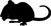

== GAME CONTENTS
7 Role Cards, 5 Dice, 1 Lombard Company Token, 3 Skip Turn Tokens, 24 Bologna Tokens, 24 Book tokens, 24 Tower Tokens, 24 People Tokens.

=== TOKENS

The game tokens show the Symbols described on the table below. When the game begins, all tokens are placed at the center of the table in a pool. During the game, players can gain tokens to include them in their final victory score, discard them or force their foes to discard them. A discarded token is returned to the pool at the center of the table.

.SYMBOLS (on dice, cards and markers)
[cols="1,1,5"]
|===
| image:imgs/paesano.png[] | People | Bologna’s citizens: crafters, traders and soldiers. 
| image:imgs/torre.png[] | Tower | Buildings such as mansions, mills, towers and castles
|  | Book | Knowledge, culture, lore and oratory skills.
| image:imgs/mortadella.png[] | Bologna | Food, filled larders and other earthy pleasures.
| image:imgs/vino.png[] | Wine | Wine and the intoxication induced by an excessive use of spirits.
|  | Rat | Diseases and other plagues that might befall the city.
|===

