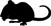
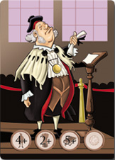

== INTRODUZIONE

Bologna, XIII secolo. Impero, Papato e Corporazioni di arti e mestieri sono i poteri forti che governano la città che, con la sua antica Università e con i suoi 60.000 abitanti, rappresenta la quinta città più popolosa d’Europa. In questi anni Bologna è il maggior centro tessile d’Italia e la sua complessa rete di canali fornisce energia alle industrie della seta mettendo in comunicazione la città con il resto del territorio, dal fiume Po al Mare Adriatico. È una città ricca e poliglotta dove si mangia bene e si beve ancora meglio, ma che deve convivere anche con disparità sociali, cospirazioni politiche, guerre ed epidemie. Una gran gioia insomma!

Ogni giocatore manovra persone e risorse per raggiungere il luogo di potere più importante e ambito della città: il Trono di Mortadella. In confronto raggiungere quello di Spade è una passeggiata.

Ogni mezzo è lecito, ogni arma è consentita, sarai in grado di raggiungere i tuoi scopi e diventare Re di Mortadella?

== SCOPO DEL GIOCO

Ogni giocatore riveste un ruolo nella Bologna fantastica de “Il Trono di Mortadella”: per decidere qual è questo ruolo ciascun giocatore pesca una carta Ruolo, che non dovrà mostrare mai agli altri per nessun motivo fino alla fine della partita. Attraverso i dadi, turno dopo turno, i giocatori accumuleranno beni e risorse oppure scateneranno effetti devastanti sui propri avversari (o anche su se stessi!): tutta la strategia di gioco dipende dal proprio ruolo e dalla propria esperienza!
 
== SEGNALINI

I Segnalini sono gettoni nei quali sono rappresentati i Simboli sotto descritti. All’inizio della partita si trovano tutti al centro del tavolo (riserva). Durante la partita i Segnalini potranno essere acquisiti dai giocatori per finire nel conto delle condizioni di vittoria, oppure scartati (o fatti scartare). In questo caso i Segnalini in questione torneranno nella riserva al centro del tavolo.

== SIMBOLI (su dadi, carte e segnalini)

[cols="1,1,5"]
|===
|  | Popolo | indica gli abitanti della città, come artigiani, commercianti e soldati 
|  | Torre | indica i possedimenti come case, palazzi, mulini, torri e castelli
|  | Libro | indica la conoscenza, la cultura, il sapere accademico e la capacità oratoria
|  | Mortadella | indica il cibo, le dispense piene e il gusto per la bella vita
|  | Vino | indica il vino e l’ebbrezza portata dal consumo sconsiderato dell’alcol
|  | Ratto | indica malattie e catastrofi che possono scatenarsi
|===

== STRUTTURA DELLE CARTE

Ogni carta è composta da 

|===
|   | - Illustrazione con Ruolo +
- Condizioni di vittoria specifiche del Ruolo (Icone nella parte bassa)
|===

RUOLI

Principe dei Tortellini:: È dedito ai piaceri della carne (in tutti i sensi) e ha fatto completamente sua la frase: “di doman non c’è certezza...” Ha sudditi e possedimenti ma non se ne preoccupa minimamente, l’unica cosa che gli preme è poter fare i suoi cinque pasti al giorno in santa pace. O guerra.

Magnifico Rettore:: Uomo di indiscusso rigore morale e sconfinata sapienza, ha rifiutato i beni voluttuari per dedicarsi ad arricchire ed espandere l’Università, dando benessere agli studenti, suoi futuri sudditi. Se l’è studiata proprio bene!

Signore della Seta:: Attraverso una vita votata al lavoro è diventato il mercante più potente della città ed è l’unico a conoscere i segreti della produzione industriale della seta all’interno dei mulini disseminati lungo la fitta rete di canali.

Capitano di Ventura:: È un condottiero che guida compagnie di spietati mercenari pronti a uccidere e farsi uccidere per il miglior offerente. Saccheggi e razzie sono il pane quotidiano di questi personaggi che ad una dimora fissa preferiscono l’avventura. Contenti loro...

Il Cardinale:: In un’epoca di santi ed eremiti lui è invece un politico redentore di peccati non suoi. Rappresenta il potere terreno della Chiesa e non esita un secondo ad approfittare di ogni occasione per accumulare nuovi fedeli e ricchezze.

Maestro dei Locandieri:: *(per partite da 3 giocatori in su)* - Trama nell’ombra, conosce i segreti di tutta la città e sa che potrà arrivare al potere solo sfruttando le sue conoscenze e ricattando i personaggi più illustri. La sua locanda ne ha viste davvero di tutti i colori!
Ha una condizione di vittoria più complessa rispetto agli altri giocatori.

Brigante:: *(solo per la partita a 7)* - Sembra sempre solo ma è al centro di una fitta rete di malviventi che lo informa e lo aiuta. Sembra il più cattivo ma non è peggiore degli altri, anzi, spesso è stato beccato mentre faceva beneficienza ai più poveri!
È l’unico ruolo di cui si scopre l’identità al primo tiro di dado.

.SVOLGIMENTO DELLA PARTITA

La partita si svolge a turni singoli che procedono in senso orario. Per determinare chi inizia ciascun giocatore lancia i cinque dadi: chi totalizza la somma più alta di Mortadelle e Vino sarà il primo a giocare.

[quote]
Le regole che seguono riguardano gruppi da 3 a 5 giocatori. Per 2, 6 o 7 giocatori vedere il capitolo “Varianti di gioco” alla fine del regolamento.

FASE 1 (_primo turno, primo giocatore_):: Il primo giocatore tira i cinque dadi e ne sceglie tre.
FASE 2:: Si attivano gli effetti dei tre dadi scelti, uno per volta, nell’ordine stabilito dal giocatore.
FASE 3:: I due dadi rimasti passano al giocatore alla sua sinistra.
FASE 1 _(turni successivi)_:: Il nuovo giocatore inizia la sua FASE 1 con i due risultati scartati dal giocatore precedente. Se sono di suo gradimento può decidere di tenerli entrambi e tirare solo gli altri tre dadi (scegliendo a questo punto un solo risultato da aggiungere) se invece fanno proprio schifo può rifiutarli e tirare tutti e cinque i dadi, continuando la partita come descritto sopra.

<<<

.EFFETTI DEI DADI
[cols="1,6"]
|===
|  | 1 *Popolo* = acquisisci 1 Segnalino Popolo. + 
2 *Popoli* = acquisisci 2 Segnalini Popolo, oppure usali per fare la Rivoluzione: fai scartare 1 Segnalino Torre o 1 Segnalino Libro a un giocatore a tua scelta.
|  | 1 *Torre* = acquisisci 1 Segnalino Torre.
|  | 1 *Libro* = acquisisci 1 Segnalino Libro oppure usalo come Jolly: converti il Segnalino Libro in qualsiasi altro simbolo a tua scelta.
|  | 1 *Mortadella* = acquisisci 1 Segnalino Mortadella.
|  | 1 *Vino* = Ebbrezza: fa scartare 1 Segnalino Popolo a un giocatore a tua scelta. Il giocatore può annullare l’effetto scartando 1 Segnalino Mortadella.  +
2 *Vini* = Ubriacatura: fa saltare il prossimo turno a un giocatore a scelta, che prende il Segnalino Salta Turno come promemoria. Il giocatore può annullare l’effetto scartando 2 Segnalini Mortadella.
|  | 1 *Ratto* = Peste: tutti i giocatori scartano 1 Segnalino Popolo. Ciascun giocatore può evitare di scartare il Segnalino Popolo scartando 1 Segnalino Torre. + 
2 *Ratti* = Peste nera: tutti i giocatori scartano 1 Segnalino Popolo e 1 Segnalino Mortadella.  Rimane valida la regola che si può evitare di scartare 1 Segnalino Popolo scartando 1 Segnalino Torre.
|===

.REGOLE AGGIUNTIVE
Quelle che seguono fanno parte del gioco a tutti gli effetti, ma si consiglia di fare pratica con un paio di partite prima iniziare a usarle.

Segnalino “Deus Ex-Machina”::
Il giocatore che lo possiede può usare questo Segnalino dopo un lancio di dadi (siano essi 3 oppure 5) per ripetere un lancio dello stesso numero di dadi. Questo Segnalino viene assegnato all’ultimo giocatore che inizia.
Dopo che è stato usato passa al giocatore alla propria destra a meno che non sia stato usato per ripetere il tiro di un giocatore avversario, allorché il Segnalino andrà a lui.

7 vizi capitali - Il troppo stroppia!:: Non si possono avere più di 7 Segnalini per simbolo. Se un giocatore arriva a 8 Segnalini anche solo con un simbolo, perde la partita e esce dal gioco. Anche in questo caso non può mostrare che ruolo ricopriva.

Festa della Porchetta - Si mangia!:: Se con il tiro dei dadi escono 5 simboli uguali di Popolo, Torre, Libro o Mortadella, tutti i giocatori acquisiscono immediatamente 1 Segnalino corrispondente al simbolo del dado. Nel caso si verificassero le condizioni di vittoria per un giocatore, vince la partita anche se non è il suo turno. Se sono più di uno i giocatori che potrebbero vincere, vince quello che avrebbe dovuto giocare prima, seguendo l’ordine orario dei turni.

Terremoto - Rrrrrumble! :: Se con il tiro dei dadi escono 5 simboli tra Ratto e Vino (ad es. 3 Ratti e 2 Vini) tutti i giocatori scartano tutti i Segnalini Torre e tutti i Segnalini Libro in gioco. Nel caso si verificassero le condizioni di vittoria per un giocatore, vince la partita anche se non è il suo turno. Se sono più di uno i giocatori che potrebbero vincere, vince quello che avrebbe dovuto giocare prima, seguendo l’ordine orario dei turni.

Carnevale - Ogni scherzo vale! :: Se con il tiro dei dadi escono 5 simboli diversi il giocatore sceglie 3 dei simboli e, invece che acquisirli dalla riserva comune, li ruba da uno o più giocatori avversari.
 
.CONDIZIONI DI VITTORIA

Un giocatore vince quando si verificano le condizioni di vittoria durante il suo turno.

.Obiettivi personaggi 
[cols="2,1,1,1,1,9"]
|===
| | Popolo | Torre | Libro | Mortadella | Note
| Principe dei Tortellini|2+|2+|2+|5+|-
| Magnifico Rettore|4+|2+|5+|-|-
| Signore della Seta|4+|6+|-|0|-
| Capitano di Ventura|5+|-|0|4+|-
| Cardinale Austero|2+|4+|4+|2+|-
| Maestro dei Locandieri|2+|2|2+|2| Con la combinazione indicata, vince se indovina il ruolo di un giocatore avversario. Se sbaglia esce dal gioco
| Brigante|0/8+*|-|0/8+*|0/8+*|Un simbolo almeno a quota 8 e gli altri due a 0
|===

Nota::
Quando un numero è seguito da “+” significa che deve avere ALMENO quel numero di Segnalini. +
Quando un numero è da solo senza segni matematici significa che il giocatore deve avere quell’ESATTO NUMERO di Segnalini perché si verifichino le condizioni di vittoria. Vale anche per lo 0.

 
VARIANTI AL GIOCO BASE

Variante per 6 giocatori::
In una partita a 6 tutti i giocatori partono con 1 Segnalino Popolo e 1 Segnalino Mortadella.

Variante per 7 giocatori::
In una partita a 7 tutti i giocatori partono con 2 Segnalini Popolo e 1 Segnalino a loro scelta. Entra inoltre il ruolo speciale del Brigante, che gioca con la carta ruolo scoperta.

Brigante::
Il Brigante tira i dadi normalmente ma i simboli di Popolo, Torre, Libro e Mortadella anziché acquisirli dalla riserva al centro del tavolo li ruba agli altri giocatori. +
Inoltre il Brigante non è soggetto alla limitazione dei 7 vizi capitali e non può essere il bersaglio del Maestro dei Locandieri. + 
*Condizioni di vittoria*: Il Brigante vince acquisendo almeno 8 Segnalini uguali a scelta tra Popolo, Libro e Mortadella, e tenendo a 0 i gli altri due simboli.

Variante per 2 giocatori:: Togliere dalle carte Ruolo il Maestro dei Locandieri e il Brigante.
Alle condizioni di vittoria di ciascun giocatore ne va aggiunta una: il giocatore vince se indovina il ruolo di un altro giocatore. Se non lo indovina scarta tutti i Segnalini, la carta Ruolo viene eliminata dalla partita e il giocatore pesca una nuova carta Ruolo e ricomincia la partita passando il turno.

--- 

[quote]
Il Trono di Mortadella ©2016 Cosplayou

Ideazione, sviluppo, design, illustrazioni, packaging, logo e nome “Trono di Mortadella” sono tutti copyright o marchi registrati. Tutti i diritti riservati.

Ideato da *Linus Games*. Progetto di Carlo Ferrari, sviluppo di Carlo Ferrari, Helios Pu e Diego Ruggeri. Si ringraziano i playtesters: Dolma Fronterrè, Marco Facchini, Rita Traversi, Maurizio Stagni.
Si ringrazia inoltre l’Associazione culturale Felsina Factory per il supporto e la consulenza.

.CONTATTI

http://www.iltronodimortadella.com
[cols="^1,^1,^1"]
|===
|  |  |  
| http://www.cosplayou.com | http://www.linusgames.com |  http://www.felsinafactory.it
|===

